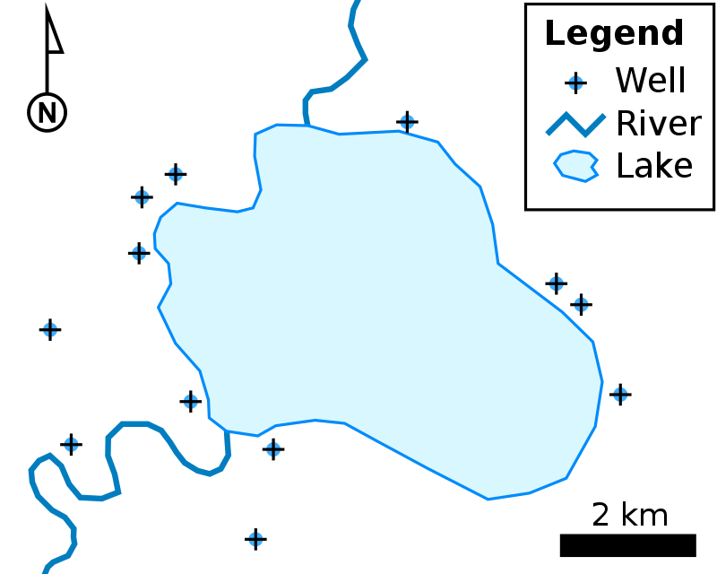
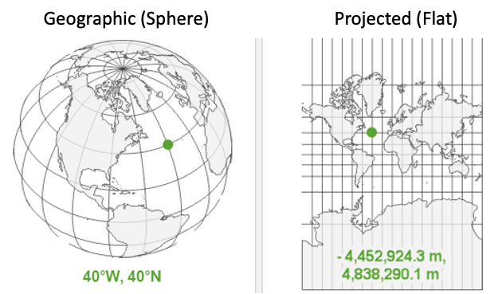
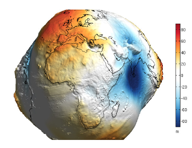
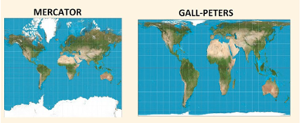
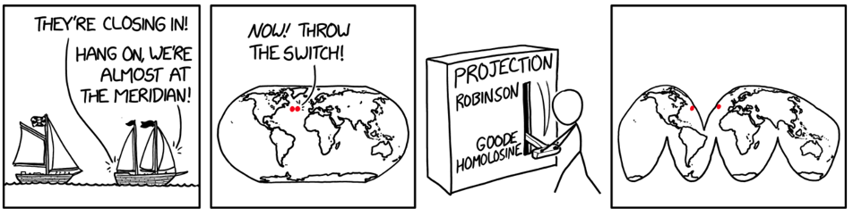
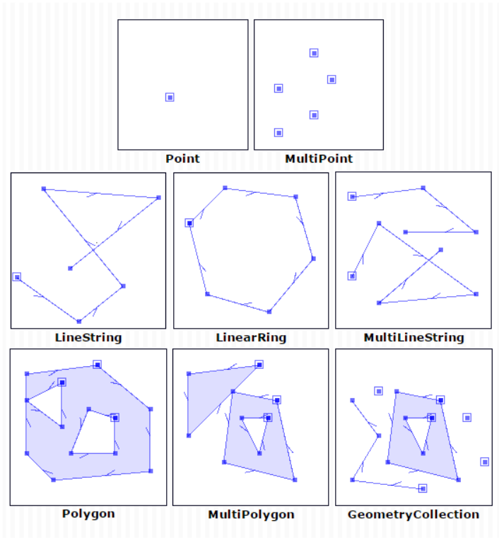

```{r setup, include=FALSE}
options(htmltools.dir.version = FALSE)
library(knitr)
opts_chunk$set(
  fig.align="center",  
  fig.height=4, #fig.width=6,
  # out.width="748px", #out.length="520.75px",
  dpi=300, #fig.path='Figs/',
  cache=T#, echo=F, warning=F, message=F
)

library(hrbrthemes)
library(fontawesome)
library(xaringanExtra)
library(countdown)

xaringanExtra::use_panelset()
xaringanExtra::use_editable()
xaringanExtra::use_clipboard()
xaringanExtra::use_logo(
  image_url = "img/lightbulb.png",
  exclude_class = c("inverse", "hide_logo"),
  width = "50px"
)

htmltools::tagList(
  xaringanExtra::use_clipboard(
    button_text = "<i class=\"fa fa-clipboard\"></i>",
    success_text = "<i class=\"fa fa-check\" style=\"color: #90BE6D\"></i>",
    error_text = "<i class=\"fa fa-times-circle\" style=\"color: #F94144\"></i>"
  ),
  rmarkdown::html_dependency_font_awesome()
)
```

# Table of contents

.large[
1. Overview of GIS concepts
2. Load and explore polygons, polylines, and points
3. Static maps
4. Interactive maps
]

---

# Overview of GIS conceps

__Spatial data:__ The two main types of spatial data are __vector data__ and __raster data__

.pull-left[
__Vector data__
* Points, lines, or polygons
* Common file formats include shapefiles (.shp) and geojsons (.geojson)
* Examples: polygons on countries, polylines of roads, points of schools
]

.pull-right[
__Raster data__
* Spatially referenced grid
* Common file format is a geotif (.tif)
* Example: Satellite imagery of nighttime lights
]

.center[


]


---

# Coordinate Reference Systems (CRS)

* Coordinate reference systems use pairs of numbers to define a location on the earth
* For example, the World Bank is at a latitude of 38.89 and a longitude of -77.04

.center[

]

---

# Coordinate Reference Systems (CRS)

There are many different coordinate reference systems, which can be grouped into __geographic__ and __projected__ coordinate reference systems. Geographic systems live on a sphere, while projected systems are “projected” onto a flat surface.

.center[

]

---

# Geographic Coordinate Systems

.pull-left[
__Units:__ Defined by latitude and longitude, which measure angles and units are typically in decimal degrees. (Eg, angle is latitude from the equator).

__Latitude & Longitude:__ 
* On a grid X = longitude, Y = latitude; sometimes represented as (longitude, latitude). 
* Also has become convention to report them in alphabetical order: (latitude, longitude) — such as in Google Maps.
* Valid range of latitude: -90 to 90
* Valid range of longitude: -180 to 180
* __{Tip}__ Latitude sounds (and looks!) like latter.
]

.center[

]

---

# Geographic Coordinate Systems

.pull-left[
__Distance on a sphere__

* At the equator (latitude = 0), a 1 decimal degree longitude distance is about 111km; towards the poles (latitude = -90 or 90), a 1 decimal degree longitude distance converges to 0 km. 
* We must be careful (ie, use algorithms that account for a spherical earth) to calculate distances! The distance along a sphere is referred to as a [great circle distance](https://en.wikipedia.org/wiki/Great-circle_distance).
* Multiple options for spherical distance calculations, with trade-off between accuracy & complexity. (See distance section for details).
]

.pull-right[

.center[

]

.center[

]

]


---

# Geographic Coordinate Systems

.pull-left[
__Datums__
* __Is the earth flat?__ No!
* __Is the earth a sphere?__ No!
* __Is the earth a lumpy ellipsoid?__ [Yes!](https://oceanservice.noaa.gov/facts/earth-round.html#:~:text=The%20Earth%20is%20an%20irregularly%20shaped%20ellipsoid.&text=While%20the%20Earth%20appears%20to,unique%20and%20ever%2Dchanging%20shape.)

The earth is a lumpy ellipsoid, a bit flattened at the poles. 
* A [datum](https://www.maptoaster.com/maptoaster-topo-nz/articles/projection/datum-projection.html) is a model of the earth that is used in mapping. One of the most common datums is [WGS 84](https://en.wikipedia.org/wiki/World_Geodetic_System), which is used by the Global Positional System (GPS). 
* A datum is a reference ellipsoid that approximates the shape of the earth.
* Other datums exist, and the latitude and longitude values for a specific location will be different depending on the datum.
]

.pull-right[

.center[

]

.center[

]

]

---

# Projected Coordinate Systems

.pull-left[
Projected coordinate systems project spatial data from a 3D to 2D surface.

__Distortions:__ Projections will distort some combination of distance, area, shape or direction. Different projections can minimize distorting some aspect at the expense of others. 

__Units:__ When projected, points are represented as “northings” and “eastings.” Values are often represented in meters, where northings/eastings are the meter distance from some reference point. Consequently, values can be very large!

__Datums still relevant:__ Projections start from some representation of the earth. Many projections (eg, [UTM](https://en.wikipedia.org/wiki/Universal_Transverse_Mercator_coordinate_system)) use the WGS84 datum as a starting point (ie, reference datum), then project it onto a flat surface. 

]

.pull-right[
Click [here](https://www.youtube.com/watch?v=eLqC3FNNOaI) to see why Toby & CJ are confused (hint: projections!) 

.center[

]

.center[

]

]

---

# Projected Coordinate Systems

.center[

]

---

# Referencing coordinate reference systems

.large[
* There are many ways to reference coordinate systems, some of which are verbose. 
* __PROJ__ (Library for projections) way of referencing WGS84 `+proj=longlat +datum=WGS84 +no_defs +type=crs`
* __[EPSG](https://epsg.io/)__ Assigns numeric code to CRSs to make it easier to reference. Here, WGS84 is `4326`. 
]

---

# Coordinate Reference Systems

Whenever have spatial data, need to know which coordinate reference system (CRS) the data is in.

* You wouldn’t say __“I am 5 away”__
* You would say __“I am 5 [miles / kilometers / minutes / hours] away”__ (units!)
* Similarly, a “complete” way to describe location would be: I am at __6.51 latitude, 3.52 longitude using the WGS 84 CRS__

---

# Introduction

- This session could be a whole course on its own, but we only have an hour and half.
- To narrow our subject, we will focus on only one type of spatial data, vector data.
- This is the most common type of spatial data that non-GIS experts will encounter in their work.
- We will use the `sf` package, which is the tidyverse-compatible package for geospatial data in R.
- For visualizing, we'll rely on `ggplot2` for static maps and `leaflet` for interactive maps

---

# Setup

1. Copy/paste the following code into a new RStudio script, __replacing "YOURFOLDERPATHHERE" with the folder within which you'll place this R project__:
```{r, eval = FALSE}
library(usethis)
use_course(
  url = "https://github.com/dime-worldbank/dime-transport-training/archive/main.zip",
  destdir = "YOURFOLDERPATHHERE"
)
```

2\. In the console, type in the requisite number to delete the .zip file (we don't need it anymore).

3\. A new RStudio environment will open. Use this for the session today.

---

# Setup

Install new packages
```{r, eval = F}
install.packages(c("sf",
                   "leaflet",
                   "geosphere"),
                 dependencies = TRUE)
```


And load them
```{r, eval = TRUE, message = FALSE, warning = FALSE}
library(here)
library(tidyverse)
library(sf)        # Simple features
library(leaflet)   # Interactive map
library(geosphere) # Great circle distances
```


---

# Load and explore polylines, polylines, and points

The main package we'll rely on is the `sf` (simple features) package. With `sf`, spatial data is structured similarly to a __dataframe__; however, each row is associated with a __geometry__. Geometries can be one of the below types.

.center[

]

---

# Load and explore polygon

The first thing we will do in this session is to recreate this data set:

```{r}
country_sf <- 
  st_read(here("DataWork",
               "DataSets",
               "Final",
               "country.geojson"))
```

---

# Exploring the data

Look at first few observations

```{r, eval = T}
head(country_sf)
```

---

# Exploring the data

Number of rows

```{r, eval = T}
nrow(country_sf)
```

---

# Exploring the data

Check coordinate reference system

```{r, eval = T}
st_crs(country_sf)
```

---

# Exploring the data

Plot the data. To plot using `ggplot2`, we use the `geom_sf` geometry.

```{r, eval = T, out.width = "60%"}
ggplot() +
  geom_sf(data = country_sf)
```

---

# Attributes of data

We want the area of each location, but we don't have a variable for area

```{r, eval = T}
names(country_sf)
```

---

# Attributes of data

Determine area. Note the CRS is spherical (WGS84), but `st_area` gives area in meters squared. R uses s2 geomety for this.

```{r, eval = T}
st_area(country_sf) 
```

---

# Operations similar to dataframes

Create new dataset that captures locations for one administrative region

```{r, eval = T}
city_sf <- country_sf %>% 
  filter(NAME_1 == "Nairobi")
```

---

# Operations similar to dataframes

Plot the dataframe

```{r, eval = T, out.width = "65%"}
ggplot() +
  geom_sf(data = city_sf)
```

---

# Load and explore polyline

.exercise[

**Exercise 1:** 
* Load the roads data `roads.geojson` and name the object `roads_sf`
* Look at the first few observations
* Check the coordinate reference system
* Map the polyline
]

--

.solution[
**Solution**: 
```{r, eval = F}
roads_sf <- st_read(here("DataWork", "DataSets", "Final", "roads.geojson"))

head(roads_sf)

st_crs(roads_sf)

ggplot() +
  geom_sf(data = roads_sf)
```
]

---

# Load and explore polyline

```{r}
roads_sf <- 
  st_read(here("DataWork",
               "DataSets",
               "Final",
               "roads.geojson"))
```

---
# Load and explore polyline

```{r}
ggplot() +
  geom_sf(data = roads_sf)

```

---

# Load and explore polyline

.exercise[

**Exercise 2:** Determine length of each line (hint: use `st_length`)

]

`r countdown(minutes = 1, seconds = 0, left = 0, font_size = "2em")`

--

.solution[
**Solution**: 
```{r}
st_length(roads_sf)
```
]

---

# Load and explore point data

We'll load a dataset of the location of schools

```{r}
schools_df <- 
  read_csv(here("DataWork",
                "DataSets",
                "Final",
                "schools.csv"))
```

---

# Explore data

```{r}
head(schools_df)
```

---

# Explore data

```{r}
names(schools_df)
```

---

# Convert to spatial object

We define the (1) coordinates (longitude and latitude) and (2) CRS. __Note:__ We must determine the CRS from the data metadata. This dataset comes from OpenStreetMaps, which uses EPSG:4326.

__Assigning the incorrect CRS is one of the most common sources of issues I see with geospatial work. If something looks weird, check the CRS!__ 

```{r}
schools_sf <- st_as_sf(schools_df, 
                       coords = c("longitude", "latitude"),
                       crs = 4326)
```

---

# Convert to spatial object

```{r}
head(schools_sf$geometry)
```

---

# Map points object: Using sf

```{r, out.width = "50%"}
ggplot() +
  geom_sf(data = schools_sf)
```

---

# Map points object: Using dataframe

```{r, out.width = "50%"}
ggplot() +
  geom_point(data = schools_df,
             aes(x = longitude,
                 y = latitude))
```

---

# Map points objects

.exercise[

**Question:** Why do the maps look different? Map using `sf` looks a bit squished!

]

`r countdown(minutes = 0, seconds = 30, left = 0, font_size = "2em")`

--

.solution[
**Solution**: 

* Units are in decimal degrees. 
* The length (eg, meters) between degrees of longitude shrinks as we go towards the equator. 
* `geom_point` thinks 1 degree distance is the same for latitudes and longitudes (dumb!). 
* `geom_sf` knows that we are in `EPSG:4326` (spherical CRS), and adjusts map to minimize distortions (smart!). 
]

---

# Make better static map

Lets make a better static map. But first, we will generate a variable calculating the squared kilometre values for each area.

```{r, out.width = "50%"}
# Adding a variable with squared km
city_sf <- city_sf %>%
  mutate(area_m = city_sf %>% st_area() %>% as.numeric(),
         area_km = area_m / 1000^2)

```

---
# Make better static map

Create a static map showing differences in squared kilometre differences for the areas within __Nairobi__
```{r, out.width = "40%"}
# Plotting
ggplot() +
  geom_sf(data = city_sf,
          aes(fill = area_km)) +
  labs(fill = "Area") +
  scale_fill_distiller(palette = "Blues") + 
  theme_void()
```

---

# Make better static map

Lets add another spatial layer. We will add points showing the locations of schools within Nairobi

```{r, out.width = "35%"}
ggplot() +
  geom_sf(data = city_sf,
          aes(fill = area_km)) +
  geom_sf(data = schools_sf,
          aes(color = "Schools")) +
  labs(fill = "Area",
       color = NULL) +
  scale_fill_distiller(palette = "Blues") + 
  scale_color_manual(values = "black") +
  theme_void()
```

---

# Interactive map

We use the `leaflet` package to make interactive maps. Leaflet is a JavaScript library, but the `leaflet` R package allows making interactive maps using R. Use of leaflet somewhat mimics how we use ggplot.

* Start with `leaflet()` (instead of `ggplot()`)
* Add spatial layers, defining type of layer (similar to geometries)


```{r l1, out.height = "40%", out.width = "50%"}
leaflet() %>%
  addTiles() # Basemap
```


---

# Interactive map

We use the `leaflet` package to make interactive maps. Leaflet is a JavaScript library, but the `leaflet` R package allows making interactive maps using R. Use of leaflet somewhat mimics how we use ggplot.

* Start with `leaflet()` (instead of `ggplot()`)
* Add spatial layers, defining type of layer (similar to geometries)

```{r l2, out.height = "40%", out.width = "50%"}
leaflet() %>%
  addTiles() %>%
  addPolygons(data = city_sf) 
```

---

# Interactive map

Add a pop-up showing the names of the __sub counties__ within __Nairobi__

```{r l3, out.height = "40%", out.width = "50%"}
leaflet() %>%
  addTiles() %>%
  addPolygons(data = city_sf,
              popup = ~NAME_2) 
```

---

# Interactive map

Add more than one layer of the points of the __schools__ within __Nairobi county__

```{r l4, out.height = "40%", out.width = "50%"}
leaflet() %>%
  addTiles() %>%
  addPolygons(data = city_sf,
              popup = ~NAME_2) %>%
  addCircles(data = schools_sf,
             popup = ~name,
             color = "black")
```

---

# Interactive map of roads

.exercise[

**Exercise 3:** Create a leaflet map with roads, using the `roads_sf` dataset. (__Hint:__ Use `addPolylines()`)

]

`r countdown(minutes = 2, seconds = 0, left = 0, font_size = "2em")`

--

.solution[

**Solution**: 
```{r, eval = F}
leaflet() %>%
  addTiles() %>%
  addPolylines(data = roads_sf)
```

]

---

# Interactive map of roads

```{r l5, out.height = "40%", out.width = "50%", eval=TRUE}
leaflet() %>%
  addTiles() %>%
  addPolylines(data = roads_sf)
```

---

# Interactive maps

We can spent lots of time going over what we can done with leaflet - but that would take up too much time. [This resource](https://rstudio.github.io/leaflet/articles/colors.html) provides helpful tutorials for things like:
* Changing the basemap 
* Adding colors
* Adding a legend
* And much more!

---

# Resources

.large[
* [sf package cheatsheet](https://github.com/rstudio/cheatsheets/blob/main/sf.pdf)
* [Spatial Data Science with Applications in R](https://r-spatial.org/book/)
* [Geocomputation with R](https://r.geocompx.org/)
]

---
class: inverse, center, middle

# Thank you!
