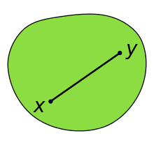
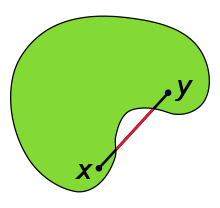
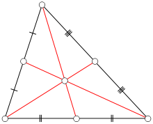
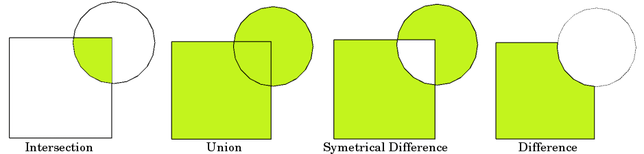

```{r setup, include=FALSE}
options(htmltools.dir.version = FALSE)
library(knitr)
opts_chunk$set(
  fig.align="center",  
  fig.height=4, #fig.width=6,
  # out.width="748px", #out.length="520.75px",
  dpi=300, #fig.path='Figs/',
  cache=T#, echo=F, warning=F, message=F
)

library(hrbrthemes)
library(fontawesome)
library(xaringanExtra)
library(countdown)

xaringanExtra::use_panelset()
xaringanExtra::use_editable()
xaringanExtra::use_clipboard()
xaringanExtra::use_logo(
  image_url = "img/lightbulb.png",
  exclude_class = c("inverse", "hide_logo"),
  width = "50px"
)

htmltools::tagList(
  xaringanExtra::use_clipboard(
    button_text = "<i class=\"fa fa-clipboard\"></i>",
    success_text = "<i class=\"fa fa-check\" style=\"color: #90BE6D\"></i>",
    error_text = "<i class=\"fa fa-times-circle\" style=\"color: #F94144\"></i>"
  ),
  rmarkdown::html_dependency_font_awesome()
)
```

# Table of contents

.large[
1. Spatial operations applied on one dataset
2. Spatial operations applied on multiple datasets
]

---

# Setup

1. Copy/paste the following code into a new RStudio script, __replacing "YOURFOLDERPATHHERE" with the folder within which you'll place this R project__:
```{r, eval = FALSE}
library(usethis)
use_course(
  url = "https://github.com/worldbank/dime-r-training/archive/main.zip",
  destdir = "YOURFOLDERPATHHERE"
)
```

2\. In the console, type in the requisite number to delete the .zip file (we don't need it anymore).

3\. A new RStudio environment will open. Use this for the session today.

---

# Setup

Install new packages
```{r, eval = F}
install.packages(c("sf",
                   "leaflet",
                   "geosphere"),
                 dependencies = TRUE)
```

---

# Setup

And load them
```{r, eval = TRUE, message = FALSE, warning = FALSE}
library(here)
library(tidyverse)
library(sf)        # Simple features
library(leaflet)   # Interactive map
library(geosphere) # Great circle distances
```

---

# Load & prep polygon of Nairobi

```{r}
country_sf <- st_read(here("DataWork", 
                           "DataSets", 
                           "Final", 
                           "country.geojson"))

city_sf <- country_sf %>% 
  filter(NAME_1 == "Nairobi")
```

---

# Load and prep polyline of roads
Read in the roads dataset using `st_read` function from the `sf` package into R

```{r}
roads_sf <- st_read(here("DataWork", 
                         "DataSets", 
                         "Final", 
                         "roads.geojson"))
```

---

# Load and prep spatial points data of schools
Read in the schools data dataset using `read.csv` function from the `dplyr` package into R

```{r}
schools_df <- read_csv(here("DataWork",
                "DataSets",
                "Final",
                "schools.csv"))
```

---

# Load and prep spatial points data of schools
Convert the __schools_df__ into a spatial dataframe using the `st_as_sf`

```{r}
schools_sf <- st_as_sf(schools_df, 
                       coords = c("longitude", "latitude"),
                       crs = 4326)
```
---

# Spatial operations applied on single dataset

* `st_transform`: Transform CRS
* `st_buffer`: Buffer point/line/polygon
* `st_combine`: Dissolve by attribute
* `st_convex_hull `: Create convex hull
* `st_centroid`: Create new sf object that uses the centroid
* `st_drop_geometry`: Drop geometry; convert from sf to dataframe
* `st_coordinates`: Get matrix of coordinates
* `st_bbox`: Get bounding box

---

# Transform CRS

The schools dataset is currently in a geographic CRS (WGS84), where the units are in decimal degrees. We'll tranform the CRS to a projected CRS ([EPSG:32632](https://epsg.io/32632)), and where the units will be in meters.

__Note that coordinate values are large!__ Values are large because units are in meters. Large coordinate values suggest projected CRS; latitude is between -90 and 90 and longitude is between -180 and 180.

```{r}
schools_utm_sf <- st_transform(schools_sf, 32632)

schools_utm_sf$geometry %>% head(2) %>% print()
```

---

# Dissolve by an attribute

Below we have the second administrative regions. Using this dataset, let's create a new object at the first administrative region level. We are going to use `st_combine` function

```{r, out.width = "30%"}
country_1_sf <- country_sf %>%
  group_by(NAME_1) %>%
  summarise(geometry = st_combine(geometry)) %>%
  ungroup()

ggplot() +
  geom_sf(data = country_1_sf)
```

---

# Buffer

We have the points of schools. Now we create a 1km buffer around schools.

```{r, out.width = "50%"}
schools_1km_sf <- schools_sf %>%
  st_buffer(dist = 1000) # Units are in meters. Thanks s2!

ggplot() +
  geom_sf(data = schools_1km_sf)
```

---

# Exercise

.exercise[

**Exercise:** Create a polyline of all trunk roads, and buffer the poyline by 10 meters. In `roads_sf`, the `highway` variable notes road types.

]

`r countdown(minutes = 2, seconds = 0, left = 0, font_size = "2em")`

--

.solution[

**Solution**: 
```{r}
roads_sf %>%
  filter(highway == "trunk") %>%
  summarise(geometry = st_combine(geometry)) %>%
  st_buffer(dist = 10)
```

]

---

# Convex Hull

__Simple definition:__ Get the outer-most coordinates of a shape and connect-the-dots.

__Formal definition:__ A convex hull of a shape the smallest "convex set" that contains it. (A [convex set](https://en.wikipedia.org/wiki/Convex_set) is where a straight line can be drawn anywhere in the space and the space fully contains the line).

.pull-left[
__Convex__


]

.pull-right[
__Not convex__


]

__Source:__ [Wikipedia](https://en.wikipedia.org/wiki/Convex_set)

---

# Convex hull

In the below example, we create a conex hull around schools; creating a polygon that includes all schools.

__Incorrect attempt__

```{r}
schools_chull1_sf <- schools_sf %>%
  st_convex_hull()

nrow(schools_chull1_sf)
```

---

# Convex hull

__Correct__

```{r, out.width = "40%"}
schools_chull2_sf <- schools_sf %>%
  summarise(geometry = st_combine(geometry)) %>%
  st_convex_hull()

ggplot() +
  geom_sf(data = schools_chull2_sf) +
  geom_sf(data = schools_sf, color = "red")
```

---

# Determine centroid

Sometimes we want to represent a polygon or polyline as a single point. For this, we can compute the centroid (ie, geographic center) of a polygon/polyline.

.center[

]

__Source:__ [Wikipedia](https://en.wikipedia.org/wiki/Centroid)

---

# Determine centroid

Determine centroid of second administrative regions

```{r, out.width = "40%"}
country_c_sf <- st_centroid(country_sf)

ggplot() +
  geom_sf(data = country_c_sf)
```

---

# Remove geometry

__Incorrect approach__

```{r}
city_sf %>% 
  select(-geometry) %>%
  head()
```

---

# Remove geometry

__Correct__

```{r}
city_sf %>% 
  st_drop_geometry() %>%
  head()
```

---

# Grab coordinates

Create a matrix of coordinates

```{r}
schools_sf %>% 
  st_coordinates() %>%
  head()
```

---

# Get bounding box

```{r}
schools_sf %>% 
  st_bbox() 
```


# Spatial operations using multiple datasets

* `st_distance`: Calculate distances.
* `st_intersects`: Indicates whether simple features intersect.
* `st_intersection`: Cut one spatial object based on another.
* `st_difference`: Remove part of spatial object based on another.  
* `st_join`: Spatial join (ie, add attributes of one dataframe to another based on location). 

---

# Distances

For this example, we'll compute the distance between each school to a motorway.

```{r}
motor_sf <- roads_sf %>%
  filter(highway == "motorway")

# Matrix: distance of each school to each motorway
dist_mat <- st_distance(schools_sf, motor_sf)

# Take minimun distance for each school
dist_mat %>% apply(1, min) %>% head()
```

---

# Distances

There are multiple ways to calculate distances!

* __Great circle:__ sf, by default, uses s2 to computer distance (in meters) when data has a geographic CRS
* __Great circle:__ Other formulas beyond s2, such as Haversine, Vincenty, and Karney’s method. See the [geosphere](https://cran.r-project.org/web/packages/geosphere/geosphere.pdf) and [geodist](https://cran.r-project.org/web/packages/geodist/geodist.pdf) packages. Vincenty is more precise than Haversine, and Karney's method is more precise than Vincenty's method. Greater precision comes with heavy computation. For more information, see [here](https://rspatial.org/raster/sphere/2-distance.html).
* __Projected:__ We can use a projected CRS, where units are in meters already.

---

# Distances

.pull-left[
```{r}
# s2
st_distance(schools_sf[1,], schools_sf[2,]) %>% 
  as.numeric()

# Nigeria-specific CRS
schools_utm_sf <- st_transform(schools_sf, 32632)
st_distance(schools_utm_sf[1,], schools_utm_sf[2,]) %>% 
  as.numeric()

# World mercator
schools_merc_sf <- st_transform(schools_sf, 3395)
st_distance(schools_merc_sf[1,], schools_merc_sf[2,]) %>% 
  as.numeric()
```

]

.pull-right[
```{r}
# Haversine
distHaversine(
  p1 = schools_sf[1,] %>% st_coordinates,
  p2 = schools_sf[2,] %>% st_coordinates)

# Vincenty's method
distVincentySphere(
  p1 = schools_sf[1,] %>% st_coordinates,
  p2 = schools_sf[2,] %>% st_coordinates)

# Karney’s method 
distGeo(p1 = schools_sf[1,] %>% st_coordinates,
        p2 = schools_sf[2,] %>% st_coordinates)
```

]

---

# Intersects

For this example we'll determine which second administrative divisions intersects with a motorway.

```{r}
# Sparse matrix
st_intersects(city_sf, motor_sf) %>% print()
```

---

# Intersects

Take `max` (`FALSE` corresponds to 0 and `TRUE` corresponds to 1). So taking max will yeild if unit intersects with _any_ motorway

```{r}
# Matrix
st_intersects(city_sf, motor_sf, sparse = F) %>% 
  apply(1, max) %>%
  head()
```

---

# Intersection

We have roads for the full city. Here, we want to create new roads object that __only includes__ roads in one unit.

```{r, out.width = "40%"}
loc_sf <- city_sf %>%
  head(1)

roads_loc_sf <- st_intersection(roads_sf, loc_sf)

ggplot() +
  geom_sf(data = roads_loc_sf)
```

---

# Difference

We have roads for all of the city. Here, we want to create new roads object that __excludes__ roads in one unit.

```{r, out.width = "40%"}
roads_notloc_sf <- st_difference(roads_sf, loc_sf)

ggplot() +
  geom_sf(data = loc_sf, fill = NA, color = "red") +
  geom_sf(data = roads_notloc_sf) 
```

---

# Overlay

Intersections and differencing are __overlay__ functions

.center[

]

---

# Spatial join

We have a dataset of schools. The school dataframe contains information such as the school name, but not on the administrative region it's in. To add data on the administrative region that the school is in, we'll perform a spatial join.

Check the variable names. No names of second administrative divison :(
```{r}
names(schools_sf)
```

---

# Spatial join

Use `st_join` to add attributes from `city_sf` to `schools_sf`. `st_join` is similar to other join methods (eg, `left_join`); instead of joining on a varible, we join based on location.

```{r}
schools_city_sf <- st_join(schools_sf, city_sf)

schools_city_sf %>% 
  names() %>% 
  print() %>%
  tail(10)
```


---

# Spatial join

.exercise[

**Exercise:** Make a static map using of administrative areas, where each administrative area polygon displays the number of schools.

]

--

.solution[
**Solution**: 
```{r}
## Dataframe of number of schools per NAME_2
n_school_df <- schools_city_sf %>%
  st_drop_geometry() %>%
  group_by(NAME_2) %>%
  summarise(n_school = n()) %>%
  ungroup()

## Merge info with city_sf
city_sch_sf <- city_sf %>% left_join(n_school_df, by = "NAME_2")

## Map
p <- ggplot() +
  geom_sf(data = city_sch_sf,
          aes(fill = n_school))
```

]

---

# Spatial join

```{r, out.width = "65%"}
ggplot() +
  geom_sf(data = city_sch_sf,
          aes(fill = n_school)) +
  labs(fill = "N\nSchools") +
  scale_fill_distiller(palette = "YlOrRd") +
  theme_void()
```

---

# Resources

.large[
* [sf package cheatsheet](https://github.com/rstudio/cheatsheets/blob/main/sf.pdf)
* [Spatial Data Science with Applications in R](https://r-spatial.org/book/)
* [Geocomputation with R](https://r.geocompx.org/)
]

---

class: inverse, center, middle

# Thank you!

